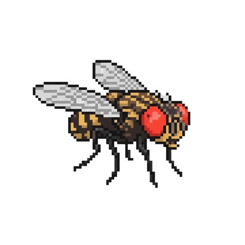
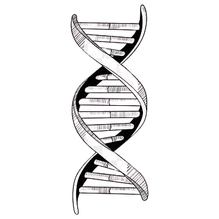

  
    

  

    
    
    
  

<h2 align="center">  Sobre Mim</h2>

  <table style="border: none; background-color: transparent;">
    <tr style="border: none; background-color: transparent;">
      <td align="center" valign="middle" style="border: none; padding-right: 20px;">
        
      </td>
      <td align="center" valign="middle" style="border: none; max-width: 600px;">
        

          Sou estudante de <b>Biotecnologia na Universidade de Brasília (UnB)</b>. Meu foco é transformar dados brutos de DNA em conhecimento biológico útil.
        

      </td>
      <td align="center" valign="middle" style="border: none; padding-left: 20px;">
        
      </td>
    </tr>
  </table>

  <table>
    <tr>
      <td align="left">
         <b>Pesquisa Atual (PIBIC):</b> 
        Montagem e anotação genômica de <i>Andropogon gayanus</i>.  
      </td>
    </tr>
  </table>

 

  
  
  
  
  
    

  
  
  
  
  
  
  
  
  
  
  
  
  
  
    

  
  
  
  

 

   
  
<i>"Science knows no country, because knowledge belongs to humanity."</i>

  <h3> <a href="https://jomaserver.github.io" style="color: #4af626; text-decoration: none;">Acesse o Jomaserver Blog</a></h3>

